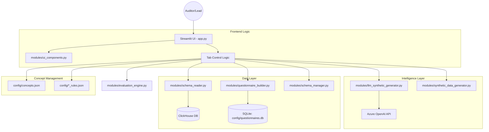

# Claims Concept Quiz Architecture Overview

## Executive Summary
The **Claims Concept Quiz** is a Streamlit-based calibration and training platform for medical claim auditors. It leverages AI (Azure OpenAI) and rule-based generation to create synthetic, non-PHI audit scenarios based on specific healthcare overpayment concepts (e.g., Anesthesia, Ambulance, Therapy).

---

## 🏗️ System Architecture

---

## 🛠️ Technology Stack
- **Framework**: Streamlit (Web UI)
- **AI/LLM**: Azure OpenAI (GPT-5.2/GPT-4o via API)
- **Database (Source)**: ClickHouse (Schema discovery)
- **Database (Local Persistence)**: SQLite (Questionnaires & Saved Scenarios)
- **Data Handling**: Pandas & NumPy
- **Styling**: Vanilla CSS (embedded in Streamlit)

---

## 🔄 Core Application Flow

### 1. Concept Selection
- App loads available concepts from `config/concepts.json`.
- Auditor selects a concept (e.g., "Orthotics").
- App loads specific logic and conditions from `config/orthotics_rules.json`.

### 2. Schema Sync
- `SchemaReader` connects to ClickHouse to fetch real-time column names silently in the background for `ClaimsInscope`.
- `SchemaManager` maps cryptic internal names (e.g., `CLCL_ID`) to user-friendly labels (**Claim Identifier**).

### 3. Questionnaire Generation & Editable Examples
- **Manual**: Leads can pick columns and write questions in Tab 2. Editable synthetic claim examples are automatically generated in a continuous `st.data_editor` Spreadsheet to match the active columns.
- **AI-Driven**: `LLMSyntheticGenerator` analyzes rules and suggests 5-7 interactive (Yes/No) questions. It also intelligently crafts **2 highly realistic matching mock claim examples** natively.
- **Persistence**: Questionnaires and their manually refined tabular string `examples_json` are saved to `config/questionnaires.db` so they persist across sessions.

### 4. Quiz Execution
- **Synthetic Data Generation**:
    - **Rule-based**: Uses hardcoded medical scenarios in `SyntheticDataGenerator.py`.
    - **LLM-based**: Generates realistic, diverse claim records conforming to the rules via GPT-4o.
- **Auditing**: Auditor reviews the "Synthetic Claim Records" and answers verification questions.
- **Grading**: `EvaluationEngine` compares auditor responses against the hidden "Ground Truth" generated by the AI/Rules.

---

## 📦 Module Breakdown

| Module | Responsibility |
| :--- | :--- |
| `app.py` | Central orchestrator, session state management, and tab routing. |
| `llm_synthetic_generator.py` | AI Prompt Engineering, result parsing, Medical Field Normalizer, dynamic fallback mechanisms mirroring Rule-based logic, and Example Generation. |
| `questionnaire_builder.py` | SQLite CRUD operations for questionnaires, explicit `examples_json` support, and cached quiz scenarios. |
| `schema_manager.py` | The "Naming Bridge" - maintains the dictionary of internal vs friendly names. |
| `synthetic_data_generator.py` | High-performance, local scenario generation for standard testing. |
| `evaluation_engine.py` | Scoring logic and feedback generation. |
| `ui_components.py` | Custom CSS, branding, and reusable layout cards. |

---

## 🛡️ Security & Privacy
- **Zero PHI**: The app generates purely synthetic data. No real member information is ever processed or stored.
- **Encapsulated Config**: Database credentials and API keys are managed via `.env` or Streamlit Secrets.
- **Local Persistence**: SQLite ensures that heavy AI generations are cached locally, reducing API costs and improving speed.
